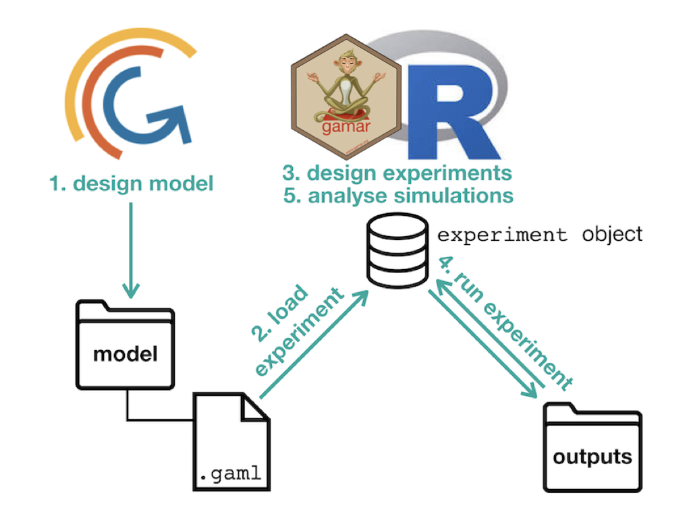

<!-- README.md is generated from README.Rmd. Please edit that file -->

```{r, echo = FALSE}
knitr::opts_chunk$set(
  collapse = TRUE,
  comment = "#>",
  fig.path = "man/figures/"
)
```

# `gamar` 

[](https://www.tidyverse.org/lifecycle/#experimental)
[](https://cran.r-project.org/package=gamar)
[](https://travis-ci.org/r-and-gama/gamar)
[](https://ci.appveyor.com/project/r-and-gama/gamar)

`gamar` is an R interface to the [GAMA](https://gama-platform.github.io)
**agent-based** simulation platform. It allows to

* **read** an experiment of a model defined in a `.gaml` file,
* **manipulate** this experiment, including generate experiment plans and
* **run** the simulations defined in an experiment plan.

An **experiment** is a group of simulations. A **simulation** is an execution of
a given **model** with

* a given set of **parameters values**,
* a given set of **observed variables**,
* a **duration** of simulation and
* a **seed** value.

All the simulations of an experiment relate to the same model. In R, an 
experiment belongs to the class `experiment` that is an extension of the class
`data.frame`. The creation and manipulation of experiments can thus efficiently
be performed with the `data.frame` methods. The class `experiment` is also
[tidyverse](https://www.tidyverse.org)-compliant, which allows its insertion
into **pipelines** (or workflows). Outputs of `experiment` runs are in an object
of class `experiment` too, with fields corresponding to the simulation outputs,
typically data frames of time series of observed variables and / or links to
snapshots that can subsequently be assembled into movies. The R environment
allows to

* create **experimental designs** (for example with the
[expand.grid()](https://www.rdocumentation.org/packages/base/versions/3.5.1/topics/expand.grid)
function),
* **statistically explore** results of simulation (how the parameters values
influence the dynamics of the variables),
* perform **sensitivity analysis** of model's parameters (how much each
parameter quantitatively influences the outputs),
* **estimate parameters values** (model calibration) if real data are available
for the model's state variables.

In addition to above-mentionned data frame, an object of class `experiment`
contains a link to a `.gaml` file containing the GAML model (**input**) and a
link to a folder containing the **outputs** of simulations. It is possible to
change these links but potentially dangerous and not advised. The `.gaml` file 
can be visualized in R but is not supposed to be modified by the user in R. 
Instead, a safe practice is to develop the model in the [GAMA](https://gama-platform.github.io) software and to reserve the use of
`gamar` to the design and exploitation of experiments' simulations as outlined
above.

<div style="text-align:center">

</div>

## Structure of experiments in `gamar`

The package `gamar` contains one unique class, `experiment` that contains all
the information of an experiment in a GAML model. This class is a subclass of
`data.frame` as outlined below:

<div style="text-align:center">

</div>

Each row of an `experiment` object corresponds to a simulation of the
experiment. The columns corresponds to four type of data:

* one column per **parameter** (whose names start with `p_`),
* one column per **monitored variable** (whose names start with `r_`),
* one column for the **duration** of the simulation (in number of time step),
* one column for the **seed** value of the simulation.

The name of the experiment, the links to **input** `.gaml` file and **output**
directory, as well as the names of paramters and monitored variables that are
common to all the simulations of the experiment are stored in the attributes of
the `experiment` object and can be handled with accessor functions.

## Installation and configuration

**The package is still on development for Windows, it will be available soon.**

You can install `gamar` from GitHub with:

```{r}
installed_packages <- row.names(installed.packages())
if (! "devtools" %in% installed_packages) install.packages("devtools")
if (! "gamar" %in% installed_packages) devtools::install_github("r-and-gama/gamar")
```

After loading, `gamar` needs to be configured, a step that basically consists in
linking `gamar` to a GAMA engine on the system. If GAMA is not installed on the
system it will download and install it for you:

```{r eval = FALSE}
setup_gama()
```

and follow instructions. Otherwise, you can input your local path to the application Gama Platform, in this case the function will not be interactive and will configure GAMA path for `gamar`:

```{r eval = FALSE}
setup_gama("path/to/gama")
```

## Developers

`gamar` is developed under the umbrella of the IRD- and OUCRU-funded EID JEAI by:

* IRD / CNRS / University of Montpellier [MIVEGEC](https://www.mivegec.ird.fr)
* IRD / University Pierre & Marie Curie [UMMISCO](http://www.ummisco.fr)
* Oxford University Clinical Research Unit [OUCRU](http://www.oucru.org)
