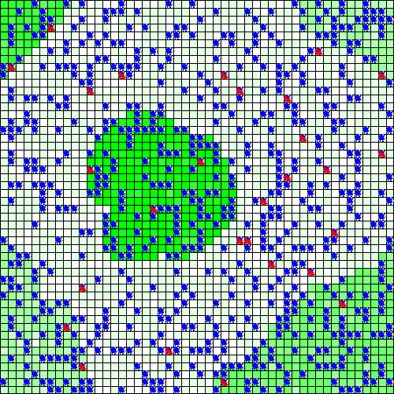

```{r setup, include = FALSE}
knitr::opts_chunk$set(
  collapse = TRUE,
  comment = "#>"
)
```

```{r Predator_prey, warning=FALSE}
# install and load the package
#install.packages("devtools")
#devtools::install_github("r-and-gama/gamar")
library(gamar)

# if necessary to configure GAMA path
# defpath("/Applications/Gama.app")
```

```{r load_experiment}
# Load an experiment
exp <- load_experiment("prey_predator",
                       system.file("models/predator_prey/models",
                                   "predator_prey.gaml", package = "gamar"))

exp
# to explore the parameters and the observed variables
parameters(exp)
obs_rates(exp)

```

```{r set_experiment}
# to set the experiment
exp$p_Initial_number_of_preys_ <- 990L
exp$p_Initial_number_of_predators_ <- 100L
exp$p_Predator_probability_reproduce_ <- 0.1
exp$tmax <- 20L
```

```{r run_experiment}
# to run the experiment
out <- run_experiment(exp, hpc = 2, display = TRUE)

```

```{r visualize_experiment, message=FALSE}
# to visualize the output
with(out$output[[1]],
     plot(Step, `r_Number_of_preys`, type = "l", lwd = 2, col = "red"))

# to make a movie
path_movie <- make_movie(out, "r_main_display")
```



